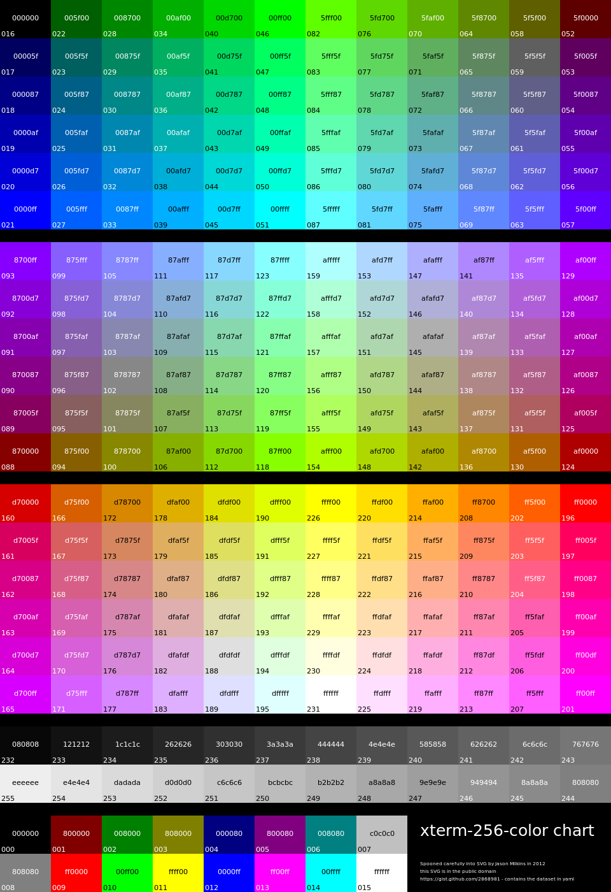

# setname!

Setname is a small program that allows you to easily customize your command prompt.

## Installation:

First git clone the repository:
```bash
git clone https://github.com/rsilva42/setname ~/setname
```
then set up the command in your `.zshrc` (it is hidden in your home directory):
```bash
alias setname='source ~/setname/setname.sh'
```
save the change and run it:
```bash
source .zshrc
```

## Usage:

The basic usage would be:
```bash
nameset "what you want the prompt to be"
```
but that would be boring :(

fret not, for there are more features!

the current features are:

```bash
nameset [-P] [-c <color number>] name [-l <length>]
```

Permanence (-P): This flag will set the prompt in your `.zshrc` so that it not change back after quitting the terminal. (Disclaimer: it may overwrite changes to `PS1` in your `.zshrc`)


Color (-c): This flag allows you to choose text color (currently only supported in three digit format) from the colors in this chart:


Length (-l): This flag will manually set the prompt name to a set length. This should mainly be used to avoid visual glitches when using special characters (such as emojis and non-english characters) in the prompt.

## Extra:

If you come across any bugs or glitches feel free to slack me them (also open to suggestions!):D

Disclaimer: I am not responsible if you mess something up with this program, I created this program with the intention to facilitate the editing of the terminal prompt.

enjoy! :)
